# 02 — Entity Relationship Diagram

> Complete ERD for the Mastery Engine database, in Mermaid syntax.
> Diagrams are split by bounded context (PostgreSQL schema) for readability; a high-level cross-context diagram follows.

---

## How to Read This Document

The ERD is split into:
1. **High-level cross-context diagram** — shows the relationships between the 10 bounded contexts.
2. **Per-context diagrams** — one per PostgreSQL schema, showing all entities and relationships within that context.
3. **Relationship legend** — explains the notation.

Mermaid syntax is used throughout. The diagrams render in GitHub, GitLab, and most Markdown viewers. For complex diagrams, the `erDiagram` syntax is used; for cross-context relationships, a flowchart is used for clarity.

---

## Relationship Legend

| Notation | Meaning |
|---|---|
| `||--||` | One-to-one |
| `||--o{` | One-to-zero-or-many |
| `||--\|{` | One-to-one-or-many |
| `}o--o{` | Many-to-many (via join table) |
| `||--o|` | One-to-zero-or-one |

In the cross-context flowchart:
- `A --> B` means "A references B" (A has a foreign key to B).
- Dotted lines indicate cross-schema references (permitted but governed by the single-writer rule).

---

## High-Level Cross-Context Diagram

This diagram shows how the 10 bounded contexts relate. Each box is a PostgreSQL schema; arrows indicate the direction of dependency (the source schema references the target).

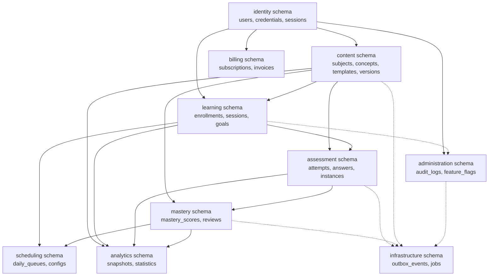

**Key observations:**
- `identity` is the root; many contexts reference users.
- `content` is referenced by learning (enrollment), assessment (attempts), mastery (concept linkage), and analytics.
- `assessment` writes to `mastery` via domain events (the Mastery Engine consumes `AttemptRecorded`).
- `infrastructure` is written to by all contexts (outbox events) but is owned by no single context.
- Cross-schema references are governed by the single-writer rule: each table is written by exactly one context.

---

## Schema: `identity`

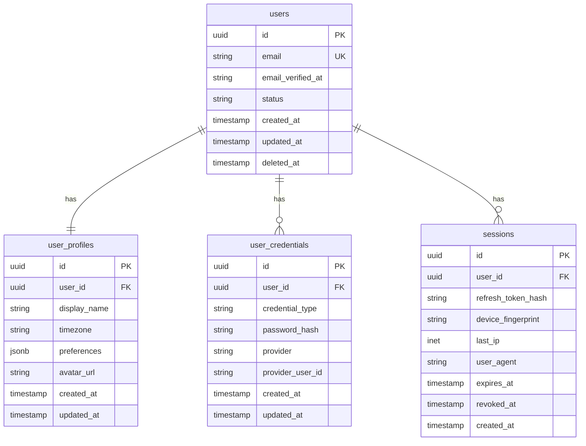

**Relationships:**
- `users` 1:1 `user_profiles` (composition — profile does not exist without user).
- `users` 1:many `user_credentials` (aggregation — a user has 1+ credentials).
- `users` 1:many `sessions` (aggregation — sessions are created and revoked).

---

## Schema: `content`

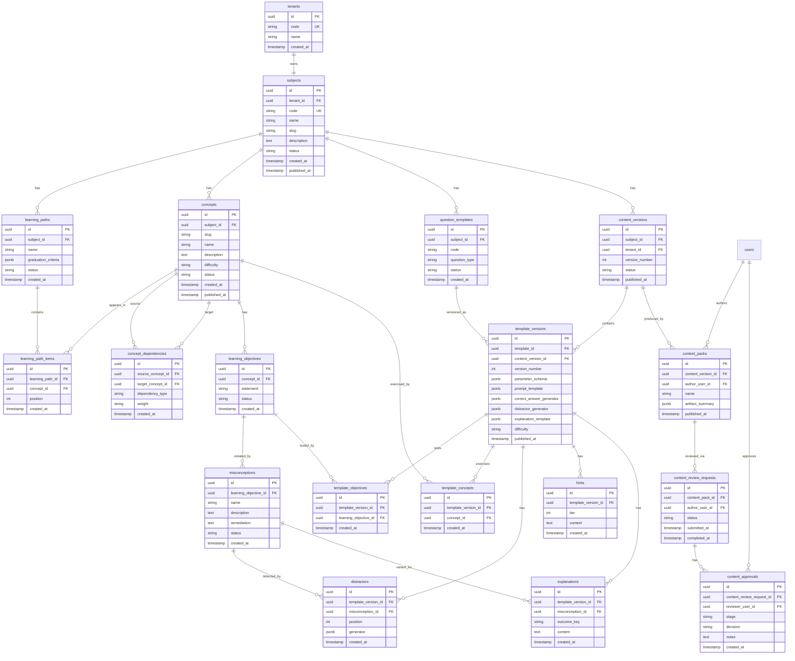

**Relationships:**
- `tenants` 1:1 `subjects` (current architecture; reserved for future multi-subject tenants).
- `subjects` 1:many `learning_paths`, `concepts`, `question_templates`, `content_versions`.
- `learning_paths` many:many `concepts` (via `learning_path_items`).
- `concepts` many:many `concepts` (via `concept_dependencies` — self-referential).
- `concepts` 1:many `learning_objectives` 1:many `misconceptions` (composition).
- `question_templates` 1:many `template_versions` (versioning).
- `template_versions` many:many `learning_objectives` (via `template_objectives`).
- `template_versions` many:many `concepts` (via `template_concepts`).
- `template_versions` 1:many `distractors`, `hints`, `explanations`.
- `distractors` many:1 `misconceptions` (tagged).
- `explanations` many:1 `misconceptions` (variant keyed by misconception).
- `content_versions` 1:many `template_versions` (contains).
- `content_versions` 1:many `content_packs` (produced by).
- `content_packs` 1:many `content_review_requests` 1:many `content_approvals`.

---

## Schema: `learning`

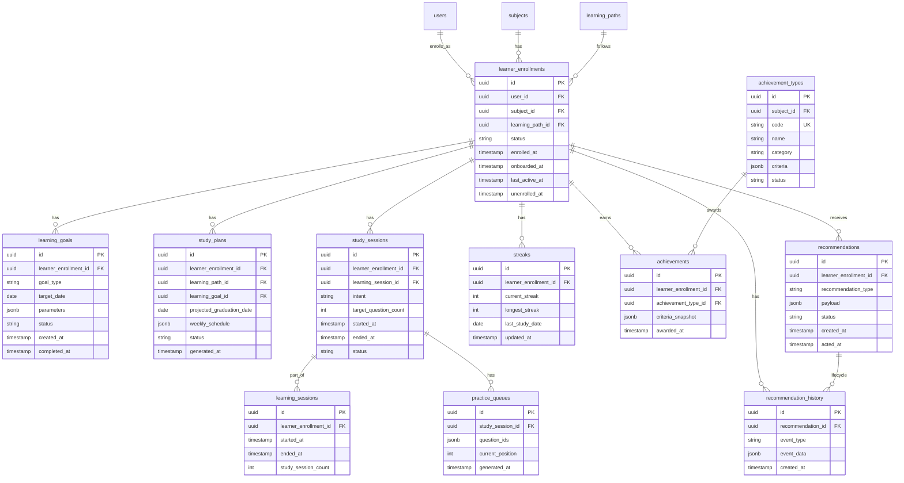

**Relationships:**
- `users` 1:many `learner_enrollments` (a user can be a learner in multiple subjects).
- `subjects` 1:many `learner_enrollments`.
- `learning_paths` 1:many `learner_enrollments` (current path).
- `learner_enrollments` 1:many `learning_goals`, `study_plans`, `study_sessions`, `streaks`, `achievements`, `recommendations`.
- `study_sessions` many:1 `learning_sessions` (a learning session groups consecutive study sessions).
- `study_sessions` 1:1 `practice_queues` (current queue snapshot).
- `achievements` many:1 `achievement_types`.
- `recommendations` 1:many `recommendation_history` (lifecycle events).

---

## Schema: `assessment`

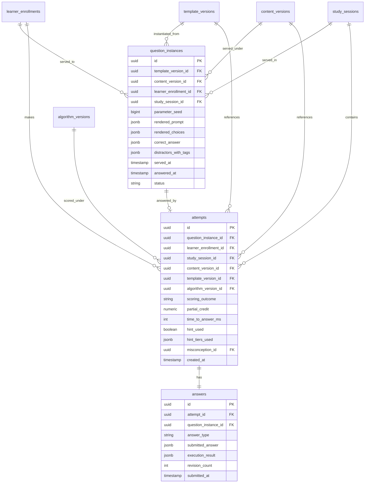

**Relationships:**
- `learner_enrollments` 1:many `question_instances` (served to).
- `template_versions` 1:many `question_instances` (instantiated from).
- `content_versions` 1:many `question_instances` (served under).
- `study_sessions` 1:many `question_instances` (served in).
- `question_instances` 1:0-or-1 `attempts` (an instance may be abandoned without an attempt).
- `learner_enrollments` 1:many `attempts`.
- `study_sessions` 1:many `attempts`.
- `attempts` many:1 `content_versions`, `template_versions`, `algorithm_versions` (triple versioning).
- `attempts` 1:1 `answers` (composition — an attempt has exactly one submitted answer).

**Critical: triple versioning** — every `attempts` row references `content_version_id`, `template_version_id`, and `algorithm_version_id`. This is the foundation of historical reproducibility (ADR-0011).

---

## Schema: `mastery`

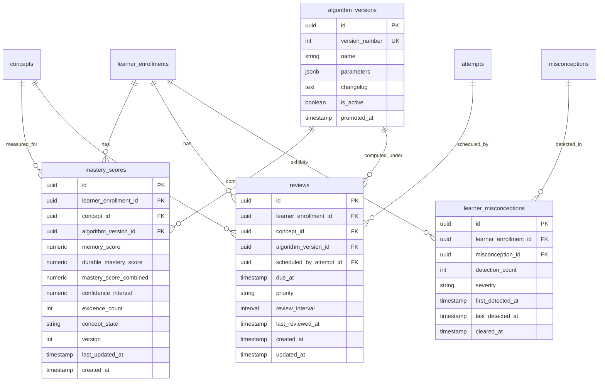

**Relationships:**
- `learner_enrollments` 1:many `mastery_scores` (one score per concept per learner).
- `concepts` 1:many `mastery_scores`.
- `algorithm_versions` 1:many `mastery_scores` (the version under which computed).
- `learner_enrollments` 1:many `reviews` (one scheduled review per concept per learner).
- `concepts` 1:many `reviews`.
- `algorithm_versions` 1:many `reviews`.
- `attempts` 1:many `reviews` (the attempt that scheduled this review).
- `learner_enrollments` 1:many `learner_misconceptions`.
- `misconceptions` 1:many `learner_misconceptions`.

**Critical: ADR-0008** — `mastery_scores` holds both `memory_score` and `durable_mastery_score` as columns, with `mastery_score_combined` as a generated column. This is the "combined, not averaged" decision.

**Critical: ADR-0011** — `mastery_scores.algorithm_version_id` records the version under which the score was computed, enabling reconstruction.

---

## Schema: `scheduling`

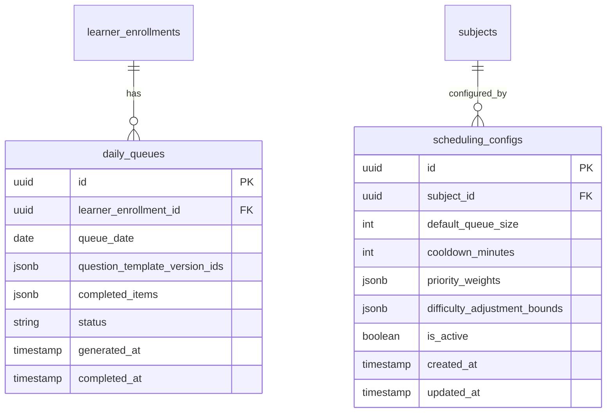

**Relationships:**
- `learner_enrollments` 1:many `daily_queues` (one per day per learner).
- `subjects` 1:many `scheduling_configs` (one active config per subject).

---

## Schema: `analytics`

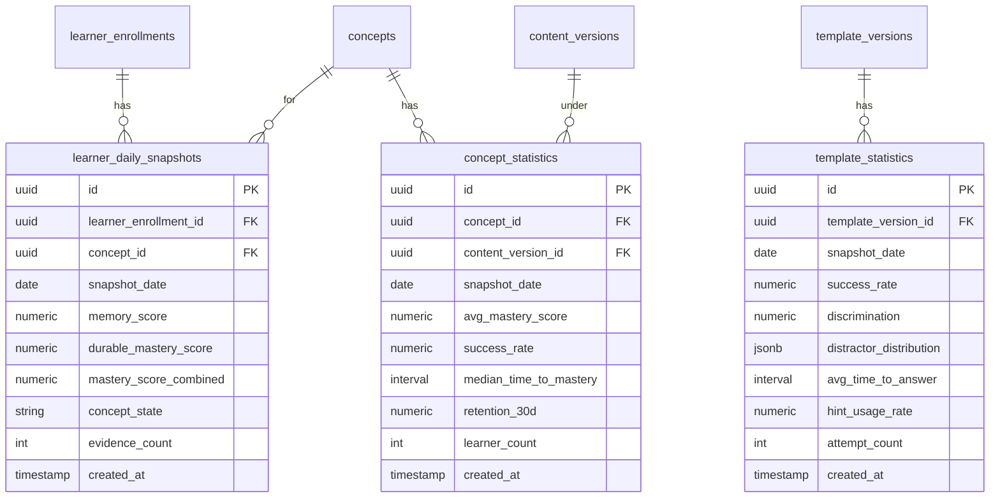

**Relationships:**
- `learner_enrollments` 1:many `learner_daily_snapshots` (one per concept per day).
- `concepts` 1:many `learner_daily_snapshots`, `concept_statistics`.
- `content_versions` 1:many `concept_statistics` (stats are per content version).
- `template_versions` 1:many `template_statistics`.

---

## Schema: `billing`

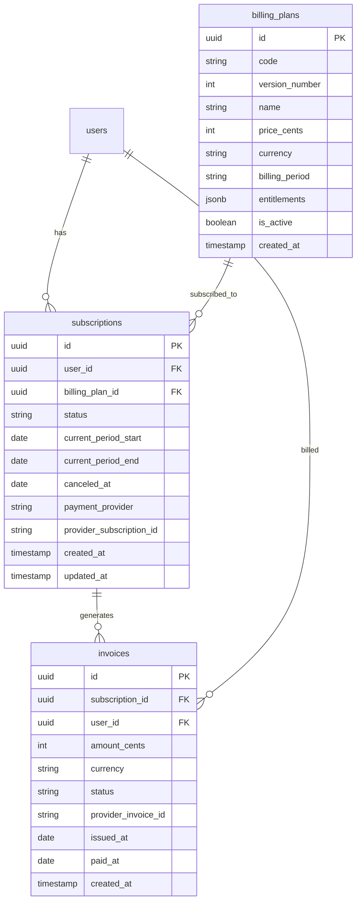

**Relationships:**
- `users` 1:many `subscriptions` (historical; one active at a time).
- `billing_plans` 1:many `subscriptions`.
- `subscriptions` 1:many `invoices`.
- `users` 1:many `invoices` (denormalized for query convenience).

---

## Schema: `administration`

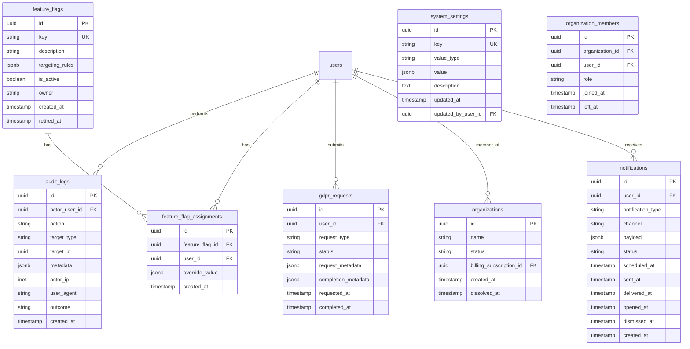

**Relationships:**
- `users` 1:many `audit_logs` (actor).
- `feature_flags` 1:many `feature_flag_assignments` (per-user overrides).
- `users` 1:many `feature_flag_assignments`.
- `users` 1:many `gdpr_requests`.
- `organizations` 1:many `organization_members` (join table; users are members of organizations).
- `users` 1:many `organization_members`.
- `users` 1:many `notifications`.

**Note:** `system_settings.updated_by_user_id` is a self-reference to `users` for audit.

---

## Schema: `infrastructure`

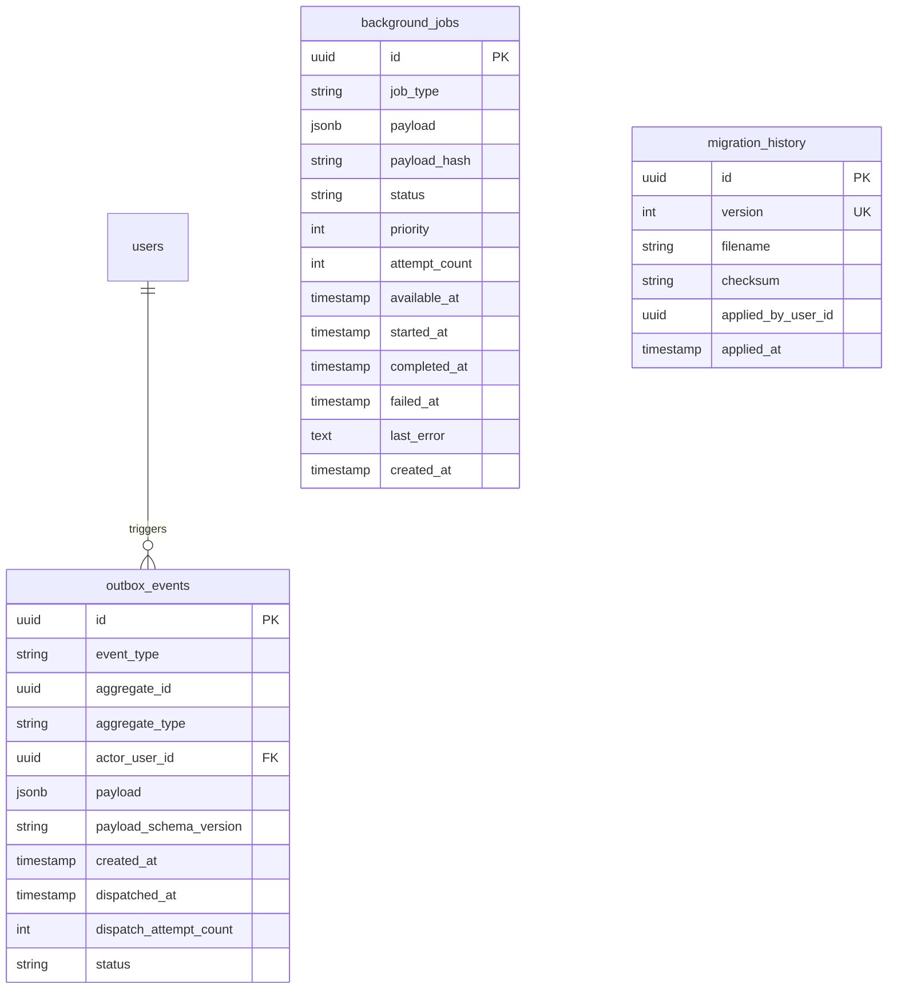

**Relationships:**
- `users` 1:many `outbox_events` (actor; nullable for system events).
- `background_jobs` and `migration_history` have no FK relationships (they reference aggregates via JSONB payload).

---

## Cross-Context Relationship Summary

The most important cross-context relationships (and the ones engineers must understand):

| Source | Target | Cardinality | Purpose |
|---|---|---|---|
| `learning.learner_enrollments` | `identity.users` | many:1 | A learner is a user enrolled in a subject. |
| `learning.learner_enrollments` | `content.subjects` | many:1 | A learner is enrolled in a subject. |
| `learning.learner_enrollments` | `content.learning_paths` | many:1 | A learner follows a path. |
| `assessment.question_instances` | `content.template_versions` | many:1 | An instance is instantiated from a template version. |
| `assessment.question_instances` | `content.content_versions` | many:1 | An instance is served under a content version. |
| `assessment.attempts` | `content.content_versions` | many:1 | Triple versioning: content version. |
| `assessment.attempts` | `content.template_versions` | many:1 | Triple versioning: template version. |
| `assessment.attempts` | `mastery.algorithm_versions` | many:1 | Triple versioning: algorithm version. |
| `assessment.attempts` | `learning.study_sessions` | many:1 | An attempt belongs to a session. |
| `mastery.mastery_scores` | `learning.learner_enrollments` | many:1 | A score is per-learner. |
| `mastery.mastery_scores` | `content.concepts` | many:1 | A score is per-concept. |
| `mastery.mastery_scores` | `mastery.algorithm_versions` | many:1 | A score records its algorithm version. |
| `mastery.reviews` | `assessment.attempts` | many:1 | A review is scheduled by an attempt. |
| `analytics.learner_daily_snapshots` | `learning.learner_enrollments` | many:1 | A snapshot is per-learner. |
| `analytics.concept_statistics` | `content.content_versions` | many:1 | Stats are per content version. |
| `administration.audit_logs` | `identity.users` | many:1 | An audit log records the actor. |
| `infrastructure.outbox_events` | `identity.users` | many:1 | An event records the triggering actor. |

---

## Inheritance and Composition Notes

The Mastery Engine schema uses **no table inheritance** (PostgreSQL's `INHERITS` is avoided due to its limitations with foreign keys and partitioning). Inheritance-style relationships are modeled via:

- **Single-table inheritance with discriminator**: e.g., `user_credentials.credential_type` ('password' | 'oauth') discriminates the credential subtype within one table.
- **Class-table inheritance with shared PK**: not used (the complexity is not justified for the current entity set).

**Composition** (child cannot exist without parent) is enforced via:
- `user_profiles.user_id` NOT NULL with ON DELETE CASCADE.
- `learning_path_items.learning_path_id` NOT NULL with ON DELETE CASCADE.
- `template_objectives`, `template_concepts`, `distractors`, `hints`, `explanations` all have `template_version_id` NOT NULL with ON DELETE CASCADE.
- `attempts.answer_id` (or `answers.attempt_id` — see logical schema) enforces composition.

**Aggregation** (child can exist without parent but is owned by it) is modeled via:
- `user_credentials.user_id` NOT NULL but ON DELETE RESTRICT (a credential cannot outlive its user, but deletion is governed by application logic, not cascade).
- `sessions.user_id` NOT NULL with ON DELETE CASCADE.
- `learner_enrollments.user_id` NOT NULL with ON DELETE RESTRICT (unenrollment is a soft process).

---

## Dependency Notes

The dependency direction (which table must exist before another) follows the schema creation order:

1. `identity` (users, user_profiles, user_credentials, sessions) — no dependencies.
2. `content` (tenants, subjects, ..., content_versions) — depends on identity (for author/reviewer).
3. `learning` (learner_enrollments, ..., achievements) — depends on identity, content.
4. `assessment` (question_instances, attempts, answers) — depends on content, learning, mastery.
5. `mastery` (algorithm_versions, mastery_scores, reviews, learner_misconceptions) — depends on learning, content, assessment.
6. `scheduling` (daily_queues, scheduling_configs) — depends on learning, content.
7. `analytics` (snapshots, statistics) — depends on learning, content, mastery.
8. `billing` (billing_plans, subscriptions, invoices) — depends on identity.
9. `administration` (audit_logs, ..., organizations, notifications) — depends on identity.
10. `infrastructure` (outbox_events, background_jobs, migration_history) — depends on identity (for actor).

Migration scripts create schemas and tables in this order to satisfy foreign key dependencies.

---

*End of ERD.*
