# 04 — State Machines

> State machines for all 18 aggregates, with Mermaid diagrams.
> Each state machine defines: states, entry/exit actions, allowed transitions, invalid transitions, triggers, and recovery.

---

## State Machine Template

For each aggregate:

- **States** — the finite set of states.
- **Entry/Exit Actions** — what happens on entering/exiting each state.
- **Allowed Transitions** — valid state changes.
- **Invalid Transitions** — explicitly forbidden changes (and why).
- **Triggers** — what causes each transition.
- **Recovery** — how to recover from an invalid or stuck state.

---

## 1. User Account

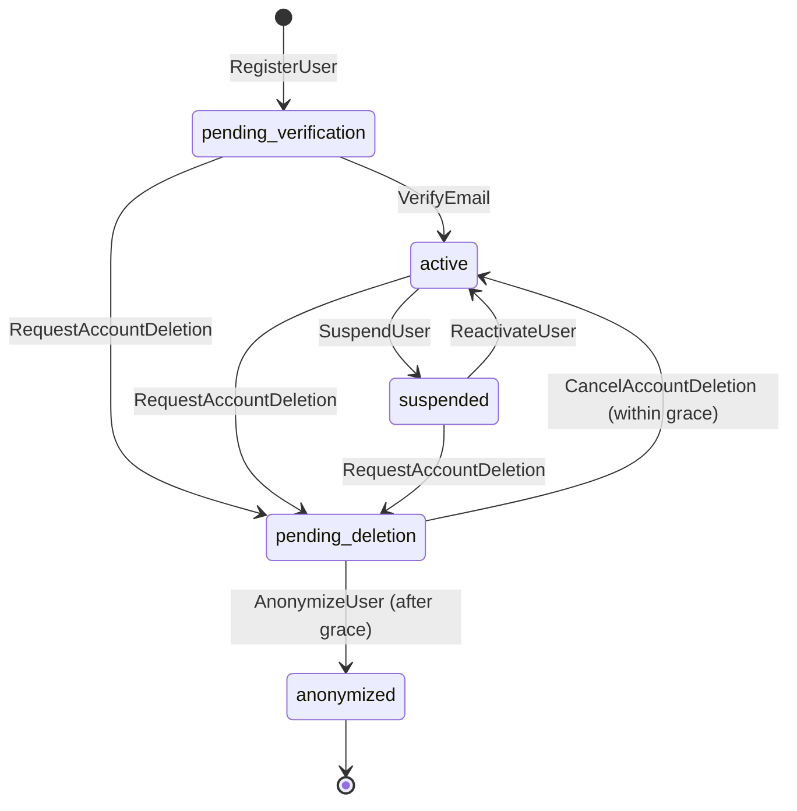
```mermaid
stateDiagram-v2
    [*] --> pending_verification: RegisterUser
    pending_verification --> active: VerifyEmail
    pending_verification --> pending_deletion: RequestAccountDeletion
    active --> suspended: SuspendUser
    active --> pending_deletion: RequestAccountDeletion
    suspended --> active: ReactivateUser
    suspended --> pending_deletion: RequestAccountDeletion
    pending_deletion --> active: CancelAccountDeletion (within grace)
    pending_deletion --> anonymized: AnonymizeUser (after grace)
    anonymized --> [*]
```

- **States**: `pending_verification`, `active`, `suspended`, `pending_deletion`, `anonymized`.
- **Entry Actions**: `active` → emit `EmailVerified`; `suspended` → revoke sessions; `anonymized` → purge PII.
- **Invalid Transitions**: `anonymized` → any (terminal); `pending_verification` → `suspended` (verify first).
- **Triggers**: commands (RegisterUser, VerifyEmail, SuspendUser, etc.).
- **Recovery**: stuck `pending_deletion` after grace → `AnonymizeUser` job; stuck `pending_verification` > 30 days → reminder email.

---

## 2. Study Session

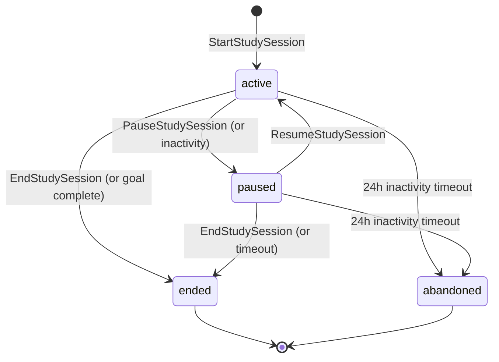
```mermaid
stateDiagram-v2
    [*] --> active: StartStudySession
    active --> paused: PauseStudySession (or inactivity)
    paused --> active: ResumeStudySession
    active --> ended: EndStudySession (or goal complete)
    paused --> ended: EndStudySession (or timeout)
    ended --> [*]
    active --> abandoned: 24h inactivity timeout
    paused --> abandoned: 24h inactivity timeout
    abandoned --> [*]
```

- **States**: `active`, `paused`, `ended`, `abandoned`.
- **Entry Actions**: `active` → generate adaptive queue; `ended` → compute session analytics; `abandoned` → record for analytics (no scoring).
- **Invalid Transitions**: `ended`/`abandoned` → any (terminal).
- **Triggers**: learner commands; system inactivity timeout.
- **Recovery**: stuck `active` > 24h → system force-ends to `ended`.

---

## 3. Attempt

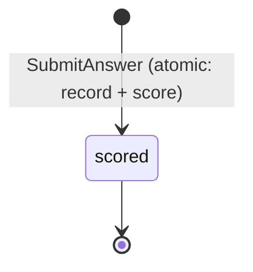
```mermaid
stateDiagram-v2
    [*] --> scored: SubmitAnswer (atomic: record + score)
    scored --> [*]
```

- **States**: `scored` (effectively a single state; attempts are append-only).
- **Entry Actions**: `scored` → emit `AttemptRecorded`; trigger mastery update.
- **Invalid Transitions**: any transition (attempts are immutable after write).
- **Triggers**: `SubmitAnswer` command.
- **Recovery**: scoring bug → append compensating attempt (never edit original).

---

## 4. Question Instance

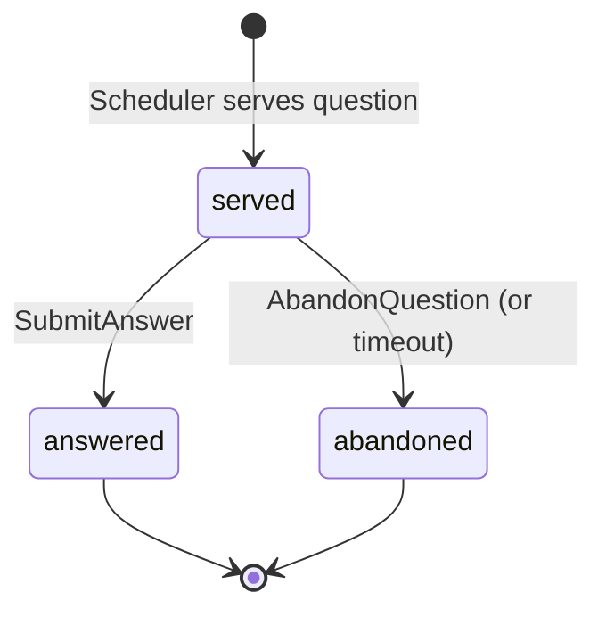
```mermaid
stateDiagram-v2
    [*] --> served: Scheduler serves question
    served --> answered: SubmitAnswer
    served --> abandoned: AbandonQuestion (or timeout)
    answered --> [*]
    abandoned --> [*]
```

- **States**: `served`, `answered`, `abandoned`.
- **Entry Actions**: `served` → start time-to-answer clock; `answered` → create Attempt; `abandoned` → emit `QuestionAbandoned`.
- **Invalid Transitions**: `answered`/`abandoned` → any (terminal).
- **Triggers**: scheduler serves; learner answers or abandons.
- **Recovery**: stuck `served` > 24h → system marks `abandoned`.

---

## 5. Question Template

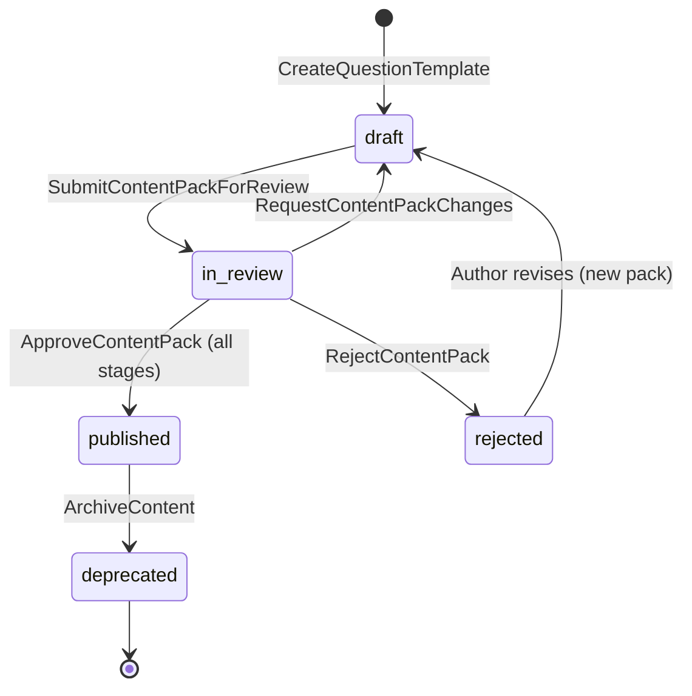
```mermaid
stateDiagram-v2
    [*] --> draft: CreateQuestionTemplate
    draft --> in_review: SubmitContentPackForReview
    in_review --> draft: RequestContentPackChanges
    in_review --> published: ApproveContentPack (all stages)
    in_review --> rejected: RejectContentPack
    published --> deprecated: ArchiveContent
    rejected --> draft: Author revises (new pack)
    deprecated --> [*]
```

- **States**: `draft`, `in_review`, `published`, `deprecated`, `rejected`.
- **Entry Actions**: `published` → create new template_version; `deprecated` → remove from scheduler candidates.
- **Invalid Transitions**: `deprecated` → `published` (create a new version instead); `rejected` → `published` (must re-review).
- **Triggers**: content pipeline commands.
- **Recovery**: stuck `in_review` > 30 days → notify author and reviewers.

---

## 6. Concept

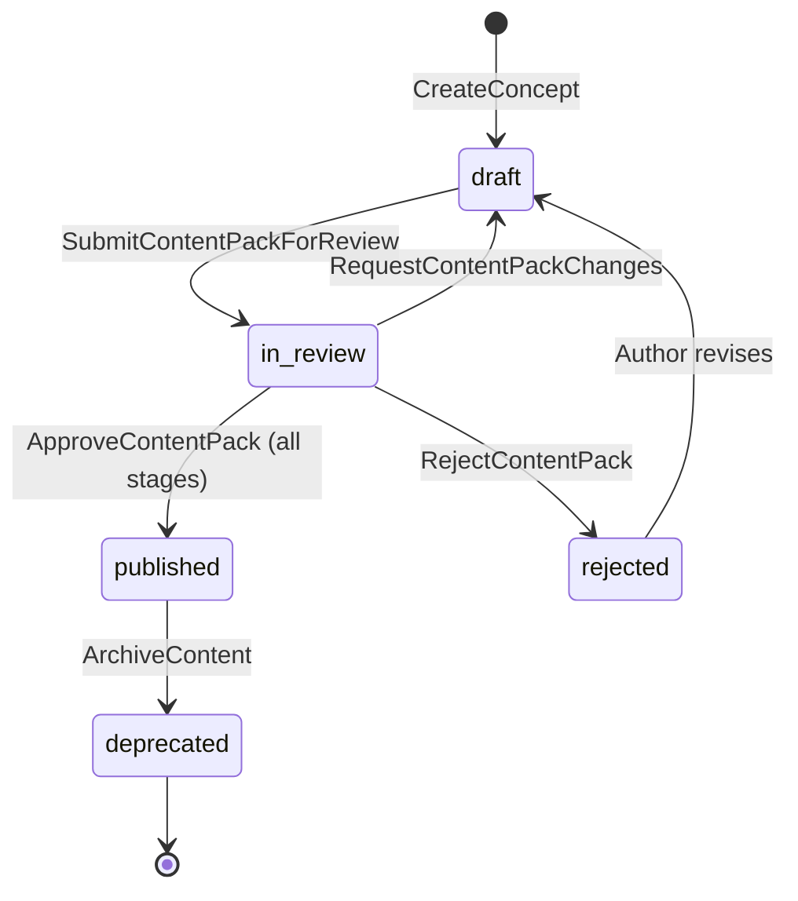
```mermaid
stateDiagram-v2
    [*] --> draft: CreateConcept
    draft --> in_review: SubmitContentPackForReview
    in_review --> draft: RequestContentPackChanges
    in_review --> published: ApproveContentPack (all stages)
    in_review --> rejected: RejectContentPack
    published --> deprecated: ArchiveContent
    rejected --> draft: Author revises
    deprecated --> [*]
```

- **States**: `draft`, `in_review`, `published`, `deprecated`, `rejected`.
- Same lifecycle as Question Template (content pipeline).
- **Recovery**: same.

---

## 7. Content Version

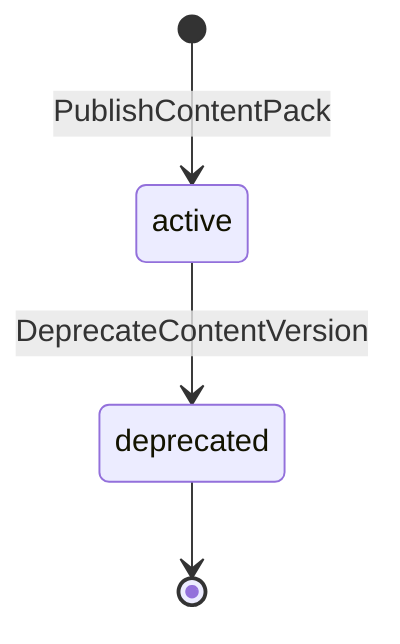
```mermaid
stateDiagram-v2
    [*] --> active: PublishContentPack
    active --> deprecated: DeprecateContentVersion
    deprecated --> [*]
```

- **States**: `active`, `deprecated`.
- **Entry Actions**: `active` → emit `ContentVersionCreated`; `deprecated` → prevent new serves.
- **Invalid Transitions**: `deprecated` → `active` (create a new version instead).
- **Triggers**: publish; deprecate.
- **Recovery**: none needed (immutable snapshots).

---

## 8. Template Version

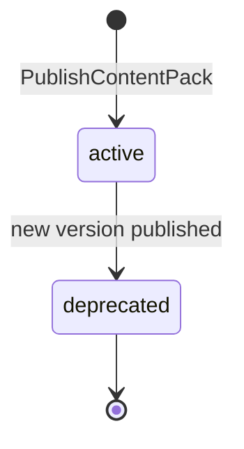
```mermaid
stateDiagram-v2
    [*] --> active: PublishContentPack
    active --> deprecated: new version published
    deprecated --> [*]
```

- **States**: `active`, `deprecated`.
- Same as Content Version (immutable snapshots).
- **Recovery**: none needed.

---

## 9. Algorithm Version

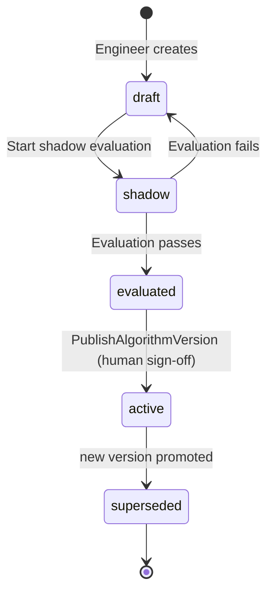
```mermaid
stateDiagram-v2
    [*] --> draft: Engineer creates
    draft --> shadow: Start shadow evaluation
    shadow --> evaluated: Evaluation passes
    shadow --> draft: Evaluation fails
    evaluated --> active: PublishAlgorithmVersion (human sign-off)
    active --> superseded: new version promoted
    superseded --> [*]
```

- **States**: `draft`, `shadow`, `evaluated`, `active`, `superseded`.
- **Entry Actions**: `active` → trigger mastery recompute; `superseded` → retained for historical reference.
- **Invalid Transitions**: `superseded` → `active`; `draft` → `active` (must pass shadow + evaluation).
- **Triggers**: ADR-0007 promotion gate.
- **Recovery**: stuck `shadow` > 30 days → notify engineering.

---

## 10. Concept State (per-learner mastery)

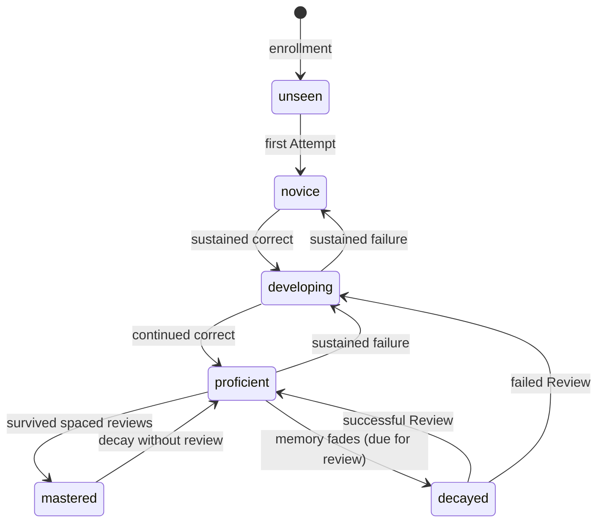
```mermaid
stateDiagram-v2
    [*] --> unseen: enrollment
    unseen --> novice: first Attempt
    novice --> developing: sustained correct
    developing --> novice: sustained failure
    developing --> proficient: continued correct
    proficient --> developing: sustained failure
    proficient --> mastered: survived spaced reviews
    mastered --> proficient: decay without review
    proficient --> decayed: memory fades (due for review)
    decayed --> proficient: successful Review
    decayed --> developing: failed Review
```

- **States**: `unseen`, `novice`, `developing`, `proficient`, `mastered`, `decayed`.
- **Entry Actions**: `mastered` → check achievement criteria; `decayed` → schedule priority review.
- **Invalid Transitions**: `unseen` → `proficient` (must pass through novice/developing).
- **Triggers**: mastery score updates (from `UpdateMastery` command).
- **Recovery**: derived state; recomputable from attempt history + algorithm version.

---

## 11. Subscription

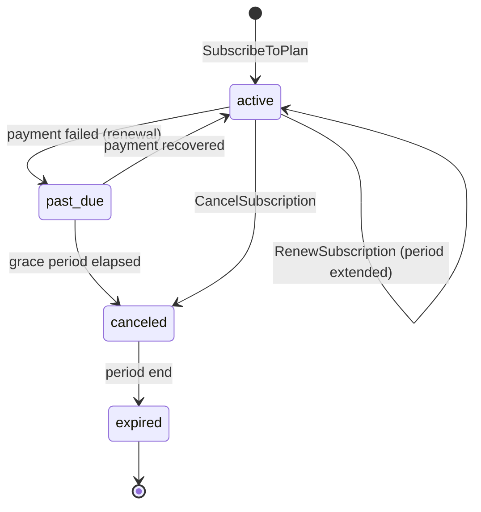
```mermaid
stateDiagram-v2
    [*] --> active: SubscribeToPlan
    active --> past_due: payment failed (renewal)
    past_due --> active: payment recovered
    past_due --> canceled: grace period elapsed
    active --> canceled: CancelSubscription
    canceled --> expired: period end
    expired --> [*]
    active --> active: RenewSubscription (period extended)
```

- **States**: `active`, `past_due`, `canceled`, `expired`.
- **Entry Actions**: `active` → emit `SubscriptionActivated`; `past_due` → notify user; `canceled` → retain entitlements until period end; `expired` → revoke entitlements.
- **Invalid Transitions**: `expired` → `active` (must subscribe anew).
- **Triggers**: billing commands and webhooks.
- **Recovery**: stuck `past_due` > grace → `canceled`.

---

## 12. Achievement

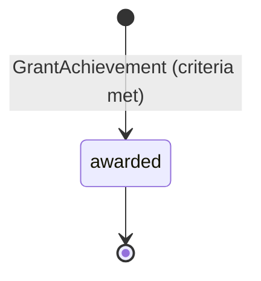
```mermaid
stateDiagram-v2
    [*] --> awarded: GrantAchievement (criteria met)
    awarded --> [*]
```

- **States**: `awarded` (single state; achievements are irreversible).
- **Entry Actions**: `awarded` → emit `AchievementGranted`; queue notification.
- **Invalid Transitions**: any (terminal once awarded).
- **Triggers**: event subscribers detect criteria met.
- **Recovery**: none (irreversible by design).

---

## 13. Review

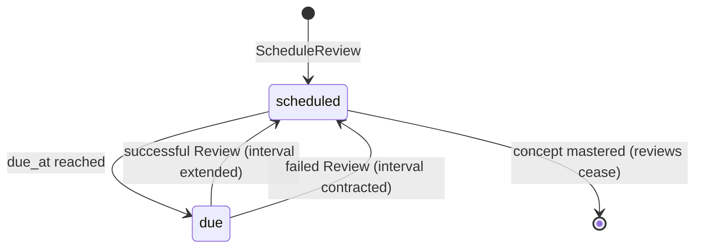
```mermaid
stateDiagram-v2
    [*] --> scheduled: ScheduleReview
    scheduled --> due: due_at reached
    due --> scheduled: successful Review (interval extended)
    due --> scheduled: failed Review (interval contracted)
    scheduled --> [*]: concept mastered (reviews cease)
```

- **States**: `scheduled`, `due`.
- **Entry Actions**: `due` → eligible for scheduler selection.
- **Invalid Transitions**: none (reviews are always either scheduled or due).
- **Triggers**: time passage; review attempts.
- **Recovery**: derived state; recomputable from attempt history + algorithm version.

---

## 14. Study Plan

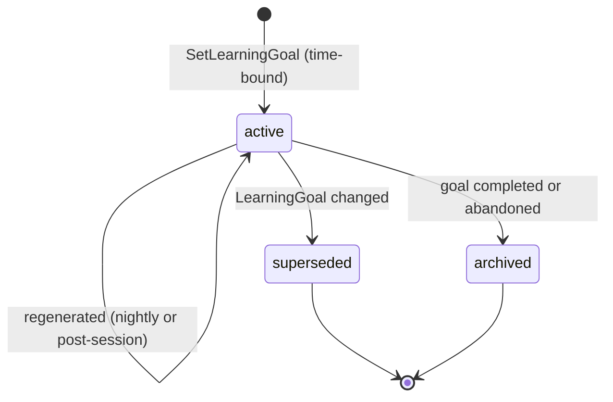
```mermaid
stateDiagram-v2
    [*] --> active: SetLearningGoal (time-bound)
    active --> active: regenerated (nightly or post-session)
    active --> superseded: LearningGoal changed
    active --> archived: goal completed or abandoned
    superseded --> [*]
    archived --> [*]
```

- **States**: `active`, `superseded`, `archived`.
- **Entry Actions**: `active` → emit `LearningGoalSet`; `superseded` → replaced by new plan.
- **Invalid Transitions**: `archived` → `active`.
- **Triggers**: goal changes; nightly regeneration.
- **Recovery**: derived; recomputable from mastery + path + goal.

---

## 15. Recommendation

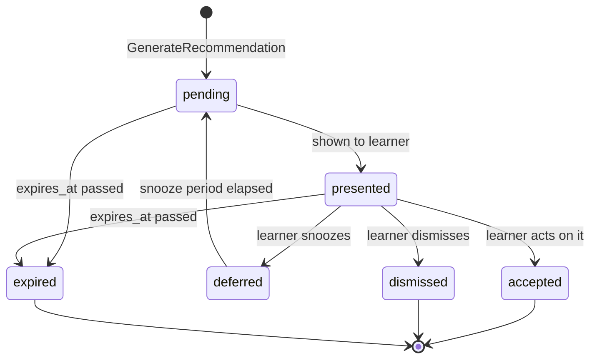
```mermaid
stateDiagram-v2
    [*] --> pending: GenerateRecommendation
    pending --> presented: shown to learner
    presented --> accepted: learner acts on it
    presented --> deferred: learner snoozes
    presented --> dismissed: learner dismisses
    pending --> expired: expires_at passed
    presented --> expired: expires_at passed
    accepted --> [*]
    deferred --> pending: snooze period elapsed
    dismissed --> [*]
    expired --> [*]
```

- **States**: `pending`, `presented`, `accepted`, `deferred`, `dismissed`, `expired`.
- **Entry Actions**: `dismissed` → 7-day cooldown on identical recommendation.
- **Invalid Transitions**: `accepted`/`dismissed`/`expired` → any (terminal).
- **Triggers**: learner actions; time passage.
- **Recovery**: stuck `pending` > 7 days → `expired`.

---

## 16. Notification

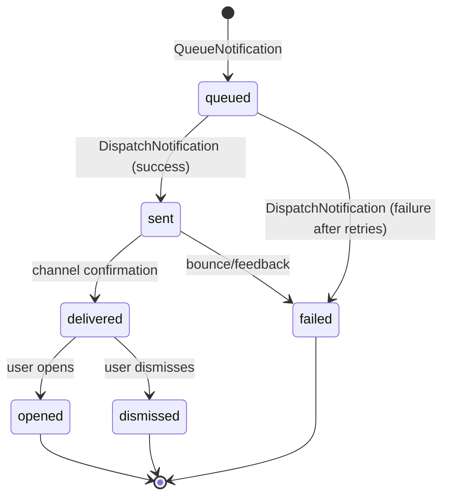
```mermaid
stateDiagram-v2
    [*] --> queued: QueueNotification
    queued --> sent: DispatchNotification (success)
    queued --> failed: DispatchNotification (failure after retries)
    sent --> delivered: channel confirmation
    sent --> failed: bounce/feedback
    delivered --> opened: user opens
    delivered --> dismissed: user dismisses
    opened --> [*]
    dismissed --> [*]
    failed --> [*]
```

- **States**: `queued`, `sent`, `delivered`, `opened`, `dismissed`, `failed`.
- **Entry Actions**: `queued` → eligible for dispatch worker; `failed` → alert.
- **Invalid Transitions**: `opened`/`dismissed`/`failed` → any (terminal).
- **Triggers**: dispatch worker; user actions; channel feedback.
- **Recovery**: stuck `queued` > 1h → retry; stuck `sent` > 24h → mark `failed`.

---

## 17. Organization

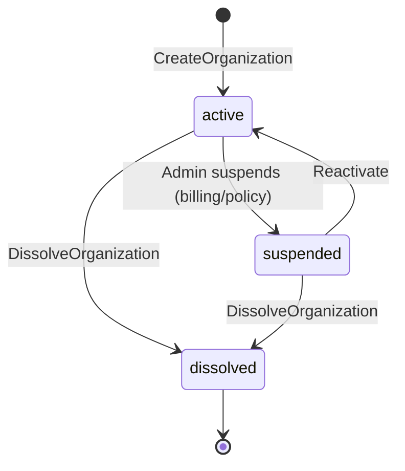
```mermaid
stateDiagram-v2
    [*] --> active: CreateOrganization
    active --> suspended: Admin suspends (billing/policy)
    suspended --> active: Reactivate
    active --> dissolved: DissolveOrganization
    suspended --> dissolved: DissolveOrganization
    dissolved --> [*]
```

- **States**: `active`, `suspended`, `dissolved`.
- **Entry Actions**: `dissolved` → member users revert to individual subscriptions.
- **Invalid Transitions**: `dissolved` → any.
- **Triggers**: admin commands.
- **Recovery**: none (dissolution is terminal).

---

## 18. Feature Flag

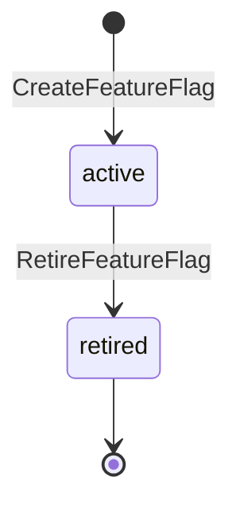
```mermaid
stateDiagram-v2
    [*] --> active: CreateFeatureFlag
    active --> retired: RetireFeatureFlag
    retired --> [*]
```

- **States**: `active`, `retired`.
- **Entry Actions**: `retired` → no longer evaluated; assignments retained 90 days.
- **Invalid Transitions**: `retired` → `active` (create a new flag if needed).
- **Triggers**: engineer commands.
- **Recovery**: none needed.

---

## State Machine Enforcement

State machines are enforced at three layers:

1. **Database CHECK constraints** — e.g., `status IN ('draft', 'in_review', 'published', 'deprecated', 'rejected')`.
2. **Domain Service invariants** — the Domain Service rejects invalid transitions (e.g., attempting to publish a `rejected` content pack raises `InvalidStateTransition`).
3. **Command handlers** — the command handler checks preconditions (e.g., `PublishContentPack` checks the pack is `in_review` at QA stage).

Invalid transition attempts are rejected with a `InvalidStateTransition` error code, logged in `audit_logs` (for privileged actions), and surfaced to the user with a clear message.

---

*End of State Machines.*
