# 06 — Sequence Diagrams

> 30+ Mermaid sequence diagrams for critical flows.

---

## 1. User Registration

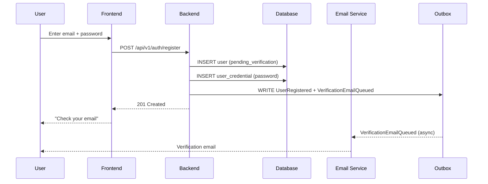

---

## 2. Email Verification

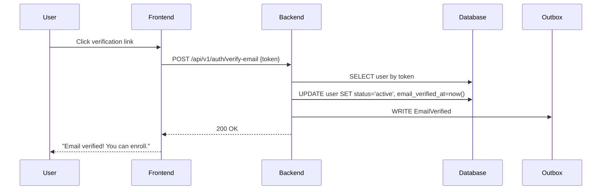

---

## 3. Login (Password)

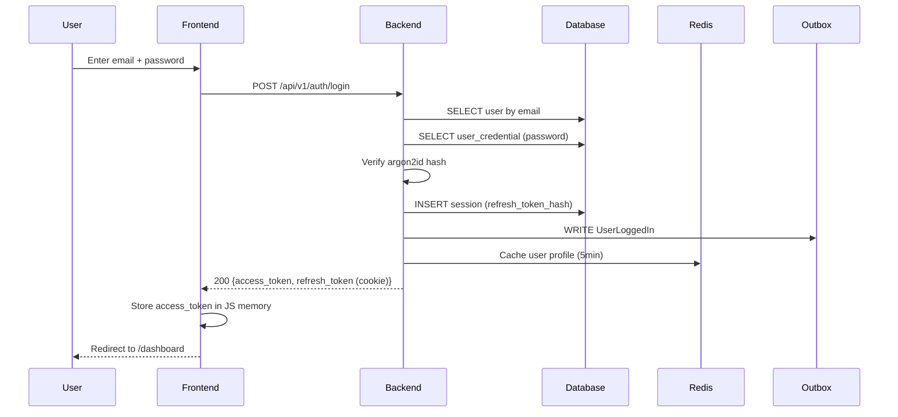

---

## 4. Token Refresh

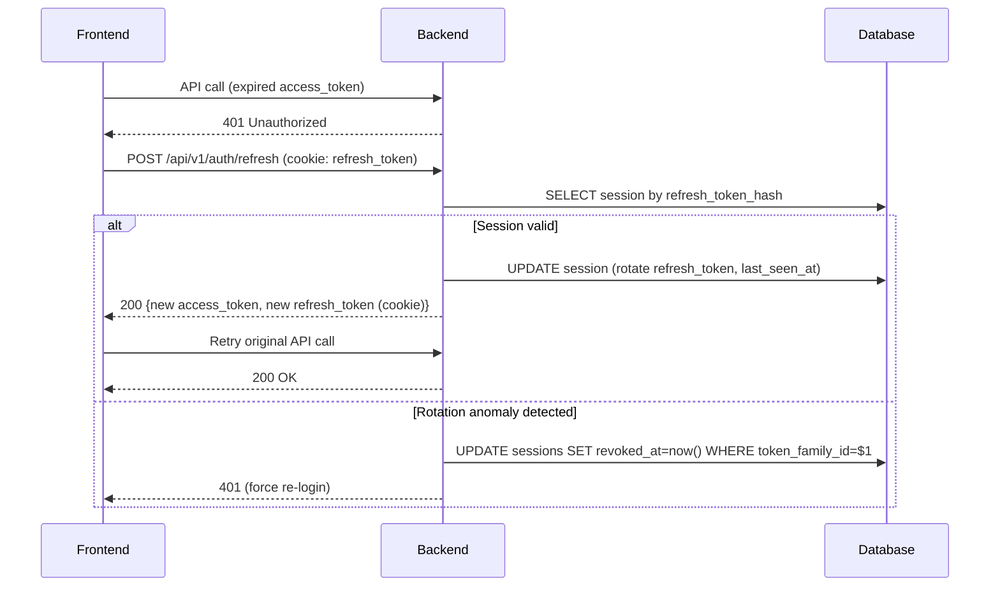

---

## 5. Enroll in Subject

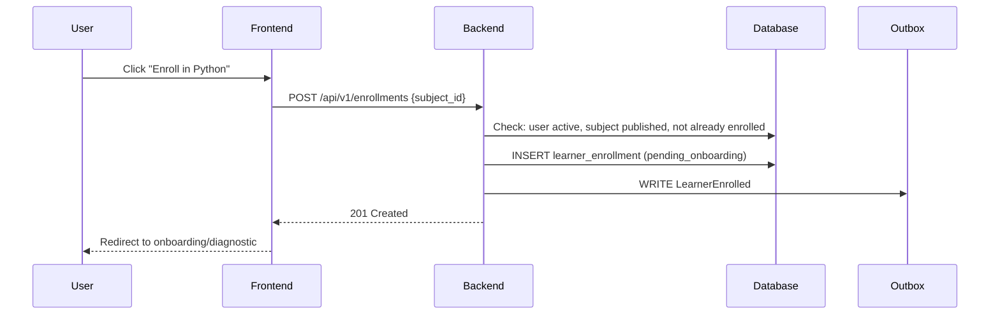

---

## 6. Daily Learning Loop (full)

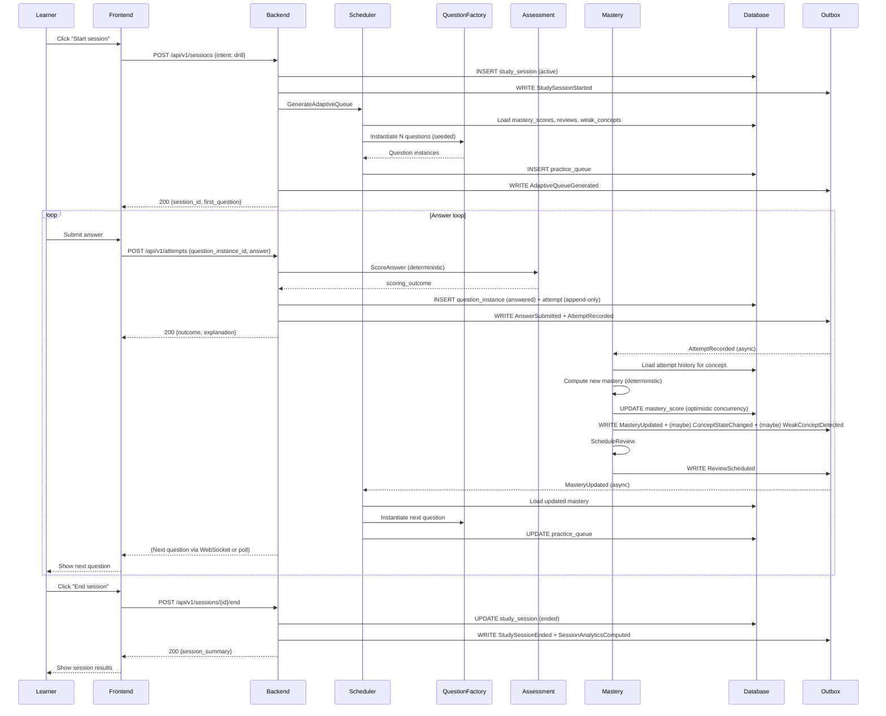

---

## 7. Adaptive Queue Generation (detail)

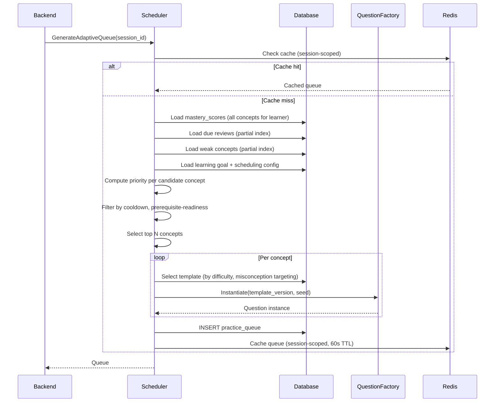

---

## 8. Mastery Update (detail)

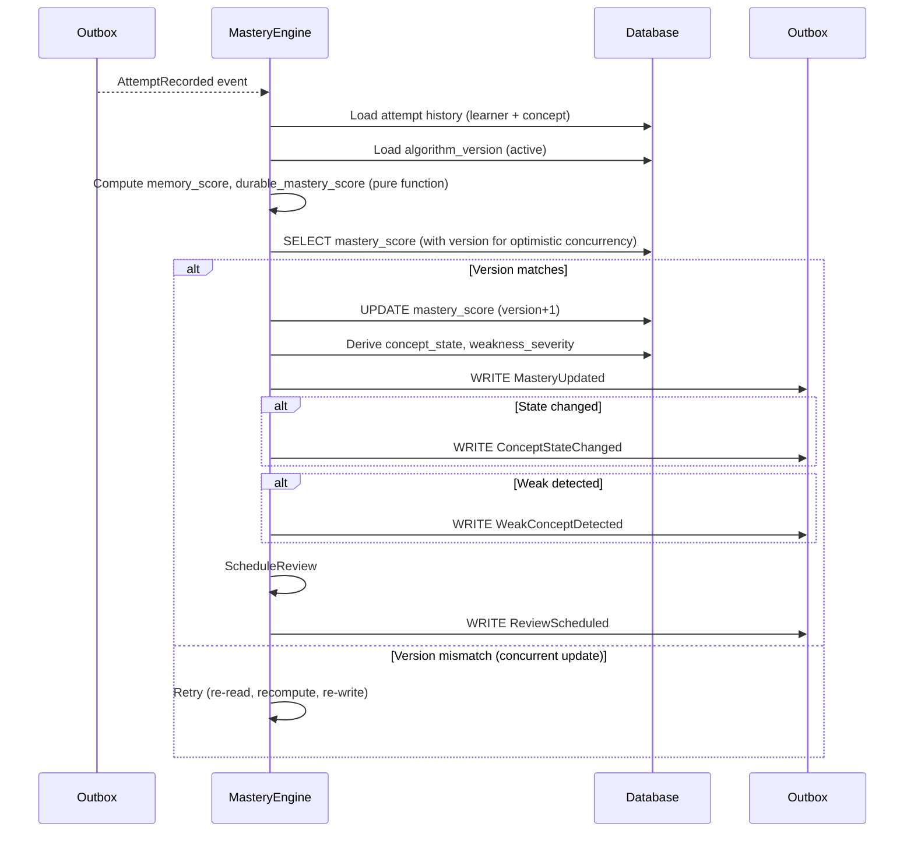

---

## 9. Review Scheduling (detail)

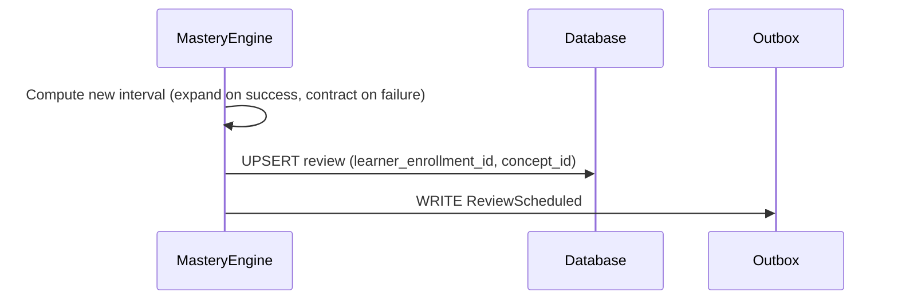

---

## 10. Content Publishing (full pipeline)

```mermaid
sequenceDiagram
    participant I as Instructor
    participant F as Admin Portal
    participant B as Backend
    participant DB as Database
    participant O as Outbox
    participant R as Reviewer
    participant Q as QA Pilot Cohort

    I->>F: Author content pack (concepts, templates)
    F->>B: SubmitContentPackForReview
    B->>DB: INSERT content_pack, content_review_request (peer_review)
    B->>O: WRITE ContentPackSubmittedForReview
    B-->>R: Notify (peer reviewer assigned)
    R->>F: Review; approve
    F->>B: ApproveContentPack (stage=peer)
    B->>DB: UPDATE review_request (editorial_review)
    B->>O: WRITE ContentPackApproved

    R->>F: Editorial review; approve
    F->>B: ApproveContentPack (stage=editorial)
    B->>DB: UPDATE review_request (qa_pilot)
    B->>O: WRITE ContentPackApproved

    B-->>Q: Serve sample questions to pilot cohort
    Q-->>B: Discrimination data
    R->>F: QA review; approve
    F->>B: ApproveContentPack (stage=qa)
    B->>B: PublishContentPack
    B->>DB: Content validation (acyclic, traceable, tagged)
    B->>DB: INSERT content_version (new)
    B->>DB: INSERT template_versions (new)
    B->>DB: UPDATE concepts.current_version_id
    B->>O: WRITE ContentPackPublished + ContentVersionCreated
    B-->>F: "Published!"
```

---

## 11. Authentication Flow (OAuth)

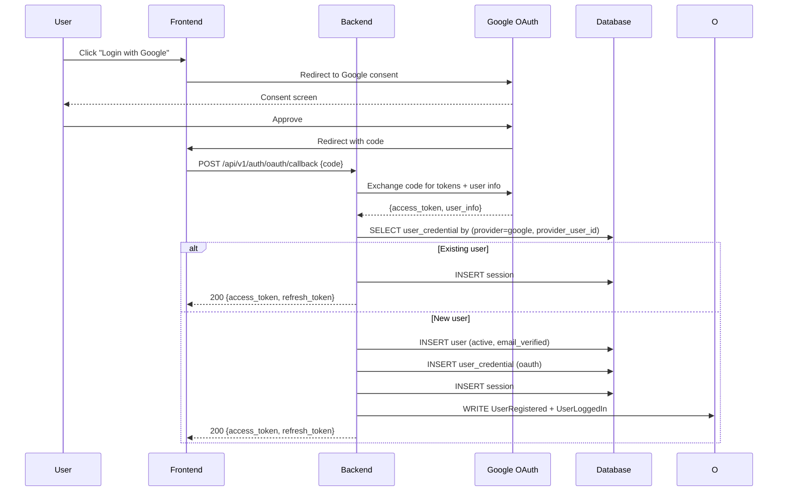

---

## 12. Recommendation Generation

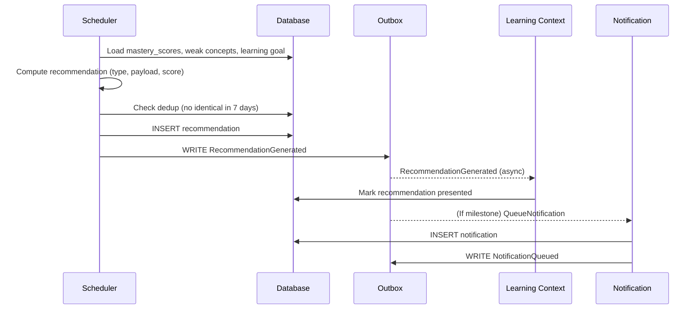

---

## 13. Algorithm Upgrade (rollout)

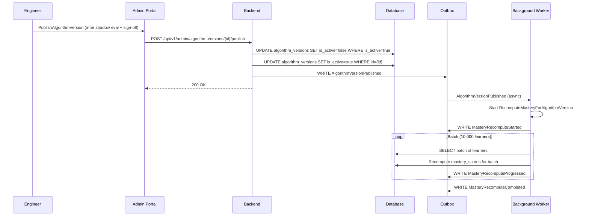

---

## 14. Notification Flow

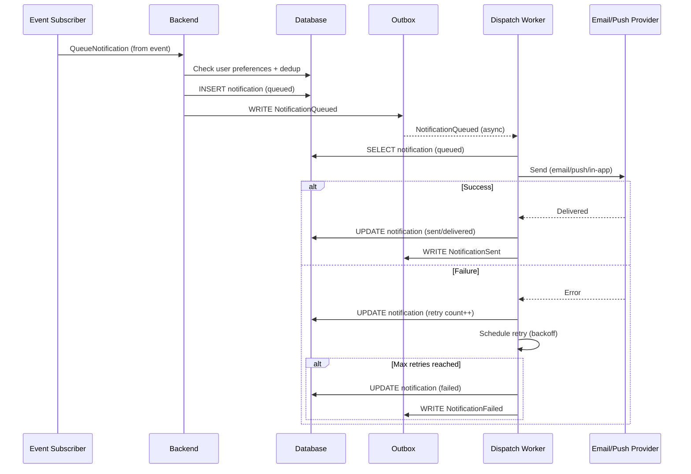

---

## 15. Subscription Upgrade

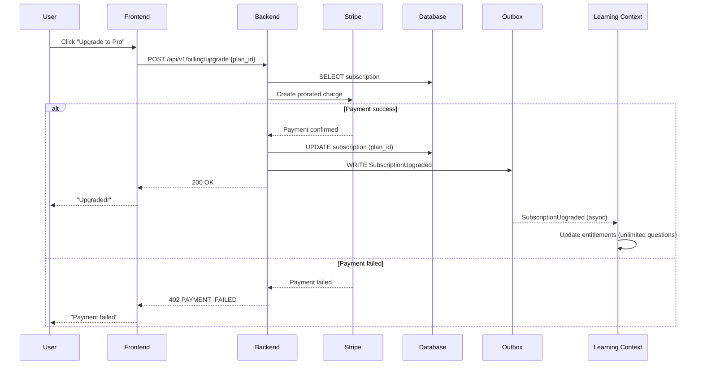

---

## 16. Payment Webhook

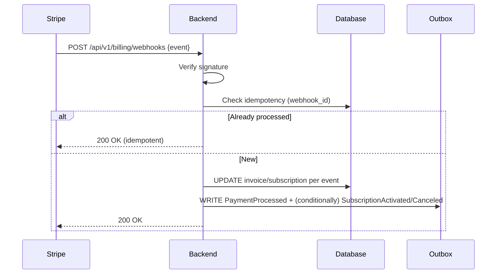

---

## 17. GDPR Erasure

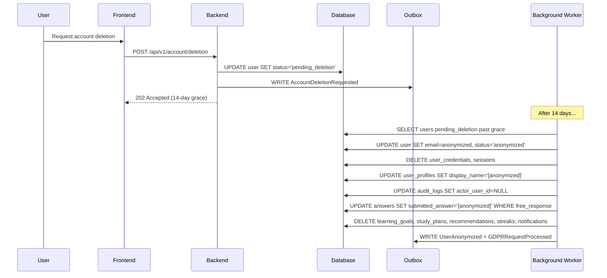

---

## 18. Background Job Processing

```mermaid
sequenceDiagram
    participant S as Event Subscriber
    participant B as Backend
    participant DB as Database
    participant W as Worker
    participant O as Outbox

    S->>B: EnqueueBackgroundJob (from event)
    B->>DB: Compute payload_hash; check dedup
    B->>DB: INSERT background_job (queued)
    W->>DB: SELECT job (queued, ordered by priority, available_at)
    W->>DB: UPDATE job (running)
    W->>W: Execute job
    alt Success
        W->>DB: UPDATE job (completed)
    else Failure
        W->>DB: UPDATE job (failed, attempt_count++)
        alt attempt_count < max
            W->>DB: UPDATE job (queued, available_at=now+backoff)
        else Max reached
            W->>DB: UPDATE job (dead_lettered)
            W->>O: WRITE BackgroundJobDeadLettered
        end
    end
```

---

## 19. Code Execution (Sandbox)

```mermaid
sequenceDiagram
    participant U as Learner
    participant F as Frontend
    participant B as Backend
    participant SB as Sandbox
    participant DB as Database
    participant O as Outbox

    U->>F: Write code; click "Run"
    F->>B: POST /api/v1/attempts/{id}/execute {code}
    B->>SB: Execute (isolated container, no network)
    SB->>SB: Run against test cases
    SB-->>B: {pass_count, fail_count, output}
    B->>DB: INSERT answer revision (pre-submission)
    B->>O: WRITE CodeExecuted
    B-->>F: 200 {results}
    F-->>U: Show pass/fail + output

    U->>F: Click "Submit"
    F->>B: POST /api/v1/attempts {final_code}
    B->>SB: Execute final
    SB-->>B: Final results
    B->>B: ScoreAttempt
    B->>DB: INSERT attempt
    B->>O: WRITE AttemptRecorded
    B-->>F: 200 {outcome, explanation}
```

---

## 20. Achievement Unlock

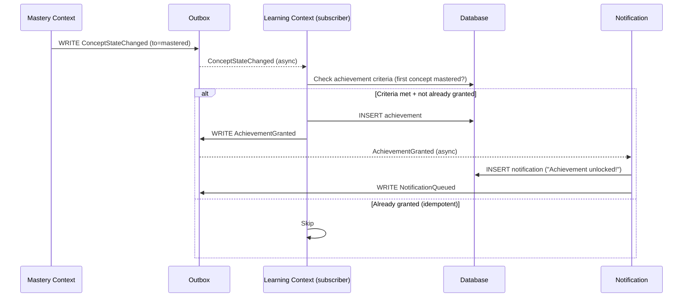

---

## 21. Feature Flag Evaluation

```mermaid
sequenceDiagram
    participant F as Frontend
    participant B as Backend
    participant R as Redis
    participant DB as Database

    F->>B: API call (with user context)
    B->>R: GET feature flag {key}
    alt Cache hit
        R-->>B: Flag config
    else Cache miss
        B->>DB: SELECT feature_flag
        B->>R: SET (1min TTL)
    end
    B->>DB: SELECT feature_flag_assignment (user override)
    B->>B: Evaluate (targeting rules + override)
    B-->>F: Response (with flag-gated behavior)
```

---

## 22. Session Pause/Resume

```mermaid
sequenceDiagram
    participant U as Learner
    participant F as Frontend
    participant B as Backend
    participant DB as Database
    participant R as Redis

    U->>F: Click "Pause"
    F->>B: POST /api/v1/sessions/{id}/pause
    B->>DB: UPDATE study_session (paused)
    B->>R: Cache queue state (24h TTL)
    B-->>F: 200 OK

    Note over U: Later (within 24h)...
    U->>F: Click "Resume"
    F->>B: POST /api/v1/sessions/{id}/resume
    B->>DB: SELECT study_session (paused, not expired)
    B->>R: GET cached queue
    B->>DB: UPDATE study_session (active)
    B-->>F: 200 {current_question}
    F-->>U: Resume at paused question
```

---

## 23. Outbox Dispatch

```mermaid
sequenceDiagram
    participant DB as Database
    participant D as Outbox Dispatcher
    participant EB as Event Bus
    participant S1 as Subscriber 1 (Mastery)
    participant S2 as Subscriber 2 (Analytics)
    participant S3 as Subscriber 3 (Notification)

    D->>DB: SELECT outbox_events WHERE status='pending' (batch)
    DB-->>D: Events
    loop Per event
        D->>EB: Dispatch event
        par Parallel delivery
            EB->>S1: Event
            EB->>S2: Event
            EB->>S3: Event
        end
        S1-->>EB: ACK
        S2-->>EB: ACK
        S3-->>EB: ACK (or NACK → retry)
        D->>DB: UPDATE outbox_events SET status='dispatched'
    end
```

---

## 24. PITR (Point-in-Time Recovery)

```mermaid
sequenceDiagram
    participant DBA as DBA
    participant FS as Object Storage
    participant R as Recovery Instance
    participant P as Primary (corrupted)

    DBA->>FS: Fetch most recent full backup (before target)
    DBA->>R: Restore full backup
    DBA->>R: Configure recovery_target_time
    R->>FS: Replay WAL segments (up to target)
    R->>R: Promote
    DBA->>R: Verify data (deleted rows present)
    DBA->>R: pg_dump affected tables
    DBA->>P: Import recovered data
    DBA->>P: Verify production
```

---

## 25. DR Failover

```mermaid
sequenceDiagram
    participant M as Monitoring
    participant O as On-Call
    participant DR as DR Standby
    participant DNS as DNS/LB
    participant A as Application
    participant U as Users

    M->>O: Alert: primary unavailable
    O->>O: Declare incident
    O->>DR: pg_ctl promote
    DR->>DR: Promote to primary
    O->>DNS: Update to point to DR region
    DNS-->>U: Route to DR
    A->>DR: Reconnect
    A->>A: Health checks pass
    A-->>U: Service restored
```

---

## 26. Nightly Analytics Snapshot

```mermaid
sequenceDiagram
    participant S as Scheduler (cron)
    participant W as Worker
    participant DB as Database
    participant O as Outbox

    S->>W: Trigger ComputeNightlySnapshots
    W->>DB: SELECT active learner_enrollments
    loop Per learner (batch)
        W->>DB: SELECT mastery_scores
        W->>DB: INSERT learner_daily_snapshots
    end
    W->>DB: INSERT concept_statistics, template_statistics
    W->>O: WRITE NightlySnapshotsComputed + ConceptStatisticsRecomputed + TemplateStatisticsRecomputed
```

---

## 27. Content Cache Invalidation

```mermaid
sequenceDiagram
    participant B as Backend (Content)
    participant O as Outbox
    participant S as Scheduling Context
    participant R as Redis

    B->>O: WRITE ContentPackPublished + ContentVersionCreated
    O-->>S: ContentPackPublished (async)
    S->>R: Invalidate content cache (subject_id)
    S->>R: Invalidate mastery cache (learners on this subject)
    S->>R: Invalidate queue cache (active sessions)
```

---

## 28. Streak Update

```mermaid
sequenceDiagram
    participant B as Backend (Learning)
    participant O as Outbox
    participant L as Learning Context (subscriber)
    participant DB as Database

    B->>O: WRITE StudySessionEnded
    O-->>L: StudySessionEnded (async)
    L->>DB: SELECT streak
    alt Last study date = today
        L->>L: No change (already counted)
    else Last study date = yesterday
        L->>DB: UPDATE streak (current_streak++, longest_streak if exceeded)
    else Gap > 1 day
        L->>DB: UPDATE streak (current_streak=1)
    end
    L->>DB: UPDATE streak (last_study_date=today)
```

---

## 29. Diagnostic Onboarding

```mermaid
sequenceDiagram
    participant U as Learner
    participant F as Frontend
    participant B as Backend
    participant S as Scheduler
    participant DB as Database
    participant O as Outbox

    U->>F: Start diagnostic
    F->>B: POST /api/v1/sessions {intent: diagnostic}
    B->>S: GenerateAdaptiveQueue (stratified sample across concepts)
    S-->>B: Diagnostic questions
    B-->>F: First question

    loop N diagnostic questions
        U->>F: Answer
        F->>B: SubmitAnswer
        B->>DB: INSERT attempt (intent=diagnostic)
        B->>O: WRITE AttemptRecorded
        O-->>Mastery: (async) UpdateMastery (baseline)
    end

    F->>B: POST /api/v1/onboarding/complete
    B->>DB: UPDATE learner_enrollment (active)
    B->>O: WRITE OnboardingCompleted
    B-->>F: 200 OK
    F-->>U: "Onboarding complete! Here's your dashboard."
```

---

## 30. Concurrent Mastery Update (optimistic concurrency)

```mermaid
sequenceDiagram
    participant W1 as Worker 1
    participant W2 as Worker 2
    participant DB as Database
    participant O as Outbox

    Note: Two attempts on the same concept arrive concurrently
    W1->>DB: SELECT mastery_score (version=5)
    W2->>DB: SELECT mastery_score (version=5)
    W1->>W1: Compute (includes attempt A)
    W2->>W2: Compute (includes attempt B)
    W1->>DB: UPDATE WHERE version=5 → success (version=6)
    W2->>DB: UPDATE WHERE version=5 → 0 rows affected (conflict)
    W2->>DB: SELECT mastery_score (version=6)
    W2->>W2: Recompute (includes attempt A + attempt B)
    W2->>DB: UPDATE WHERE version=6 → success (version=7)
    W2->>O: WRITE MasteryUpdated
```

---

## 31. Organization Member Addition

```mermaid
sequenceDiagram
    participant A as Org Admin
    participant F as Admin Portal
    participant B as Backend
    participant DB as Database
    participant O as Outbox

    A->>F: Add member (email)
    F->>B: POST /api/v1/organizations/{id}/members {user_id, role}
    B->>DB: Check: user exists, not already member
    B->>DB: INSERT organization_member
    B->>O: WRITE OrganizationMemberAdded
    B-->>F: 201 Created
    F-->>A: "Member added"
```

---

## 32. Migration Application

```mermaid
sequenceDiagram
    participant E as Engineer
    participant MR as Migration Runner
    participant DB as Database
    participant O as Outbox

    E->>MR: Apply migrations
    MR->>DB: Acquire advisory lock
    MR->>DB: SELECT migration_history (last version)
    loop Per pending migration
        MR->>DB: BEGIN
        MR->>DB: Apply migration (DDL)
        MR->>DB: INSERT migration_history
        MR->>DB: COMMIT
    end
    MR->>DB: Release advisory lock
    MR->>O: WRITE MigrationApplied (per migration)
```

---

*End of Sequence Diagrams.*
