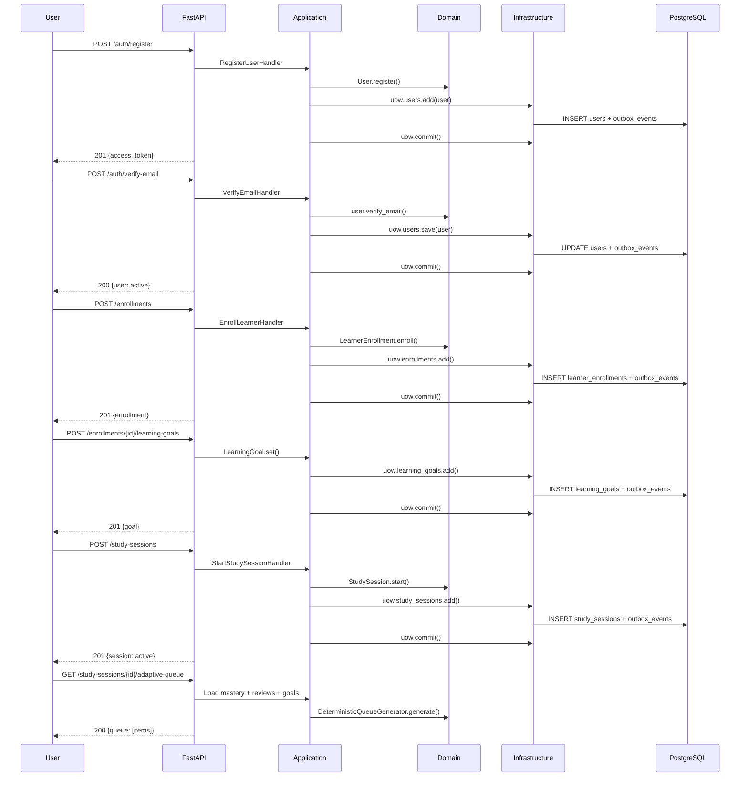

# Vertical Slice 01 — Learner Onboarding & Session Bootstrap

> **Status:** v1.0 — First end-to-end feature proving the architecture is viable.

---

## What This Is

The first vertical slice integrating all layers: Register → Verify → Enroll → Set Goal → Start Session → Get Adaptive Queue.

## Sequence Diagram



## Events Emitted

| Step | Event | Producer |
|---|---|---|
| Register | `UserRegistered` | identity |
| Verify Email | `EmailVerified` | identity |
| Enroll | `LearnerEnrolled` | learning |
| Set Goal | `LearningGoalSet` | learning |
| Start Session | `StudySessionStarted` | learning |

All events written to `infrastructure.outbox_events` within the same transaction.

## Transaction Boundaries

| Endpoint | Transactions | Aggregates |
|---|---|---|
| POST /auth/register | 1 | User (create) |
| POST /auth/verify-email | 1 | User (update) |
| POST /enrollments | 1 | LearnerEnrollment (create) |
| POST /enrollments/{id}/learning-goals | 1 | LearningGoal (create) |
| POST /study-sessions | 1 | StudySession (create) |
| GET /study-sessions/{id}/adaptive-queue | 0 (read-only) | none |

## Failure Scenarios

| Scenario | HTTP | Error Code |
|---|---|---|
| Duplicate email | 409 | EMAIL_ALREADY_REGISTERED |
| Weak password | 422 | VALIDATION_FAILED |
| Invalid verify token | 404 | USER_NOT_FOUND |
| Enroll without auth | 401 | UNAUTHORIZED |
| Duplicate enrollment | 409 | ALREADY_ENROLLED |
| Active session exists | 409 | ACTIVE_SESSION_EXISTS |
| Invalid session intent | 422 | VALIDATION_FAILED |
| Session not found | 404 | SESSION_NOT_FOUND |
| Session not active | 409 | SESSION_NOT_ACTIVE |

## Adaptive Queue (v1)

Generated by `DeterministicQueueGenerator` — pure domain service, no ML.

Priority factors:
- **Due reviews** (0.35 weight) — spaced repetition
- **Weak concepts** (0.30 weight) — remediation
- **New concepts** (0.20 weight) — progression
- **Goal urgency** (0.15 weight) — time-bound goals

Same inputs → same output (deterministic, invariant I3).

## How to Run

```bash
# Docker Compose
docker compose up -d
open http://localhost:8000/docs

# Local
cd backend && uvicorn app.main:app --reload
pytest tests/test_vertical_slice.py -v
```

## Not in This Slice

- Attempt submission (next slice)
- Mastery updates
- Review scheduling
- Content management
- Notifications
- Billing
