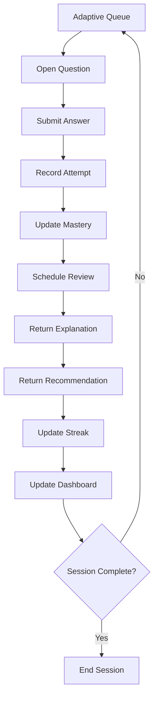
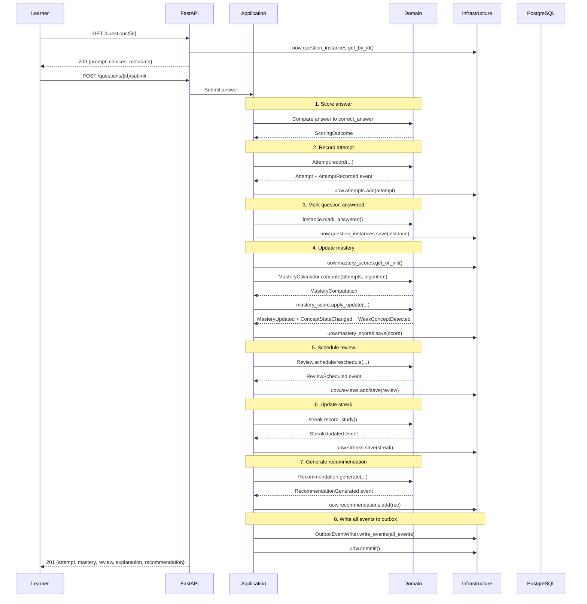

# Vertical Slice 02 — Complete Learning Loop

> **Status:** v1.0 — Second end-to-end feature completing the learning loop.

---

## What This Is

This slice completes the actual learning loop. A learner can now:

1. Receive an adaptive queue
2. Open a question
3. Submit an answer
4. Have the attempt recorded
5. Have mastery updated
6. Have a review scheduled
7. Receive an explanation
8. Receive a recommendation
9. See the dashboard updated

Everything runs through FastAPI → Application → Domain → Infrastructure → PostgreSQL. No mocks.

## Learning Loop Diagram



## Sequence Diagram



## Transaction Boundaries

| Endpoint | Transaction | Aggregates Modified | Events Written |
|---|---|---|---|
| GET /questions/{id} | 0 (read-only) | none | none |
| POST /questions/{id}/submit | 1 | Attempt (create), QuestionInstance (update), StudySession (update), MasteryScore (update), Review (create/update), Streak (update), Recommendation (create) | AttemptRecorded, QuestionInstanceAnswered, MasteryUpdated, ConceptStateChanged, WeakConceptDetected, ReviewScheduled, StreakUpdated, RecommendationGenerated |
| GET /dashboard | 0 (read-only) | none | none |

The submit endpoint is the most complex transaction in the system. All 7 aggregate modifications and 8 events are committed in a single transaction, ensuring atomicity.

## Events Flow

```
AttemptRecorded
    ↓ (consumed by Mastery Engine subscriber)
MasteryUpdated
    ↓ (triggers review scheduling)
ReviewScheduled
    ↓
ConceptStateChanged (if state changed)
    ↓
WeakConceptDetected (if weakness detected)
    ↓
RecommendationGenerated (if weakness or mastery)
    ↓
StreakUpdated
    ↓
QuestionInstanceAnswered
```

All events are written to the `infrastructure.outbox_events` table within the same transaction. The outbox dispatcher delivers them to subscribers asynchronously.

## API Examples

### Get Question

```bash
GET /api/v1/questions/550e8400-e29b-41d4-a716-446655440000
Authorization: Bearer eyJ...

# Response
{
  "question_instance_id": "550e8400-...",
  "concept_ids": ["660e8400-..."],
  "difficulty": "medium",
  "estimated_duration_seconds": 60,
  "question_type": "multiple_choice",
  "prompt": {"question": "What is the time complexity of dict lookup?"},
  "choices": [{"id": "a", "text": "O(1)"}, {"id": "b", "text": "O(n)"}],
  "metadata": {"served_at": "2026-07-02T14:30:00Z"}
}
```

### Submit Answer

```bash
POST /api/v1/questions/550e8400-e29b-41d4-a716-446655440000/submit
Authorization: Bearer eyJ...
Content-Type: application/json

{
  "answer": {"choice": "a"},
  "answer_type": "multiple_choice",
  "confidence": 0.8,
  "time_spent_seconds": 15,
  "hint_used": false
}

# Response (201 Created)
{
  "attempt": {
    "attempt_id": "770e8400-...",
    "scoring_outcome": "correct",
    "partial_credit": null,
    "time_to_answer_ms": 15000,
    "hint_used": false,
    "created_at": "2026-07-02T14:30:15Z"
  },
  "mastery": {
    "concept_id": "660e8400-...",
    "memory_score": 0.85,
    "durable_mastery_score": 0.35,
    "mastery_score_combined": 0.55,
    "concept_state": "novice",
    "weakness_severity": "none",
    "evidence_count": 1,
    "last_attempt_at": "2026-07-02T14:30:15Z"
  },
  "review": {
    "concept_id": "660e8400-...",
    "due_at": "2026-07-05T14:30:15Z",
    "priority": "low",
    "interval_days": 3
  },
  "explanation": {
    "content": "Correct! The answer is 'O(1)'. Well done.",
    "outcome_key": "correct"
  },
  "recommendation": null
}
```

### Dashboard

```bash
GET /api/v1/dashboard
Authorization: Bearer eyJ...

# Response
{
  "enrollment_id": "880e8400-...",
  "recommended_action": "start_session",
  "current_streak": 3,
  "longest_streak": 5,
  "weak_concepts": [...],
  "strong_concepts": [...],
  "today_reviews": 2,
  "today_queue_remaining": 15,
  "daily_progress": 0.0,
  "interview_readiness": 0.42,
  "memory_trend": [...],
  "mastery_trend": [...]
}
```

## Explanation Rules

| Outcome | Hint Used | Explanation Style |
|---|---|---|
| Correct | No | Short reinforcement ("Correct! Well done.") |
| Correct | Yes | Encouragement + reminder to try without hints |
| Partial | Any | Shows the full correct answer with guidance |
| Incorrect | No | Detailed explanation with correct answer |
| Incorrect | Yes | Expanded explanation with additional context |

## Review Scheduling

Intervals are deterministic (ADR-0007), based on:

| Factor | Effect |
|---|---|
| Correct answer | Expand interval (×2.5) |
| Incorrect answer | Contract interval (×0.3) |
| Partial credit | Slight expansion (proportional) |
| Hint used | Reduces effective credit (×0.7) |

Bounds: minimum 1 day, maximum 365 days.

Priority:
- Memory score < threshold × 0.5 → HIGH
- Memory score < threshold → MEDIUM
- Otherwise → LOW

## Recommendation Rules

| Condition | Recommendation |
|---|---|
| Weak concept (severity ≥ mild) | `weak_concept_remediation` |
| Concept mastered | `advance_to_next` |
| Otherwise | None (null in response) |

## Failure Cases

| Scenario | HTTP | Error Code |
|---|---|---|
| Get answered question | 409 | QUESTION_ALREADY_ANSWERED |
| Get abandoned question | 409 | QUESTION_ABANDONED |
| Get nonexistent question | 404 | QUESTION_NOT_FOUND |
| Submit without auth | 401 | UNAUTHORIZED |
| Submit to nonexistent question | 404 | QUESTION_NOT_FOUND |
| Submit to answered question | 409 | QUESTION_ALREADY_ANSWERED |
| Submit with confidence > 1.0 | 422 | VALIDATION_FAILED |
| Submit with negative time | 422 | VALIDATION_FAILED |
| No active algorithm version | 500 | ALGORITHM_VERSION_NOT_ACTIVE |

## State Changes

| Aggregate | Before | After |
|---|---|---|
| QuestionInstance | served | answered |
| Attempt | (none) | created (immutable) |
| MasteryScore | unseen/novice | updated (memory, durable, combined, state, severity, version++) |
| Review | (none or existing) | created/rescheduled (due_at, interval, priority) |
| Streak | 0 or N | N+1 (if new day) |
| StudySession | question_count=N | question_count=N+1 |

## Performance Notes

- The submit endpoint touches 7 aggregates in one transaction.
- Target latency: < 200ms at p99.
- The MasteryCalculator is a pure function (no I/O) — computation is < 1ms.
- All events are written to the outbox in the same INSERT batch.
- The dashboard endpoint is read-only and cacheable (60s TTL).

## Future Extension Points

1. **QuestionFactory** — instantiate real questions from QuestionTemplate + seed (currently placeholder UUIDs).
2. **Concept linkage** — connect attempts to concepts via template_concepts (currently uses a placeholder concept).
3. **Event subscribers** — wire the outbox dispatcher to actually deliver events to async handlers (mastery recompute, analytics, notifications).
4. **Explanation variants** — load from database instead of building dynamically.
5. **Recommendation engine** — rule-based engine with more sophisticated logic.
6. **Dashboard caching** — Redis cache with event-driven invalidation.
