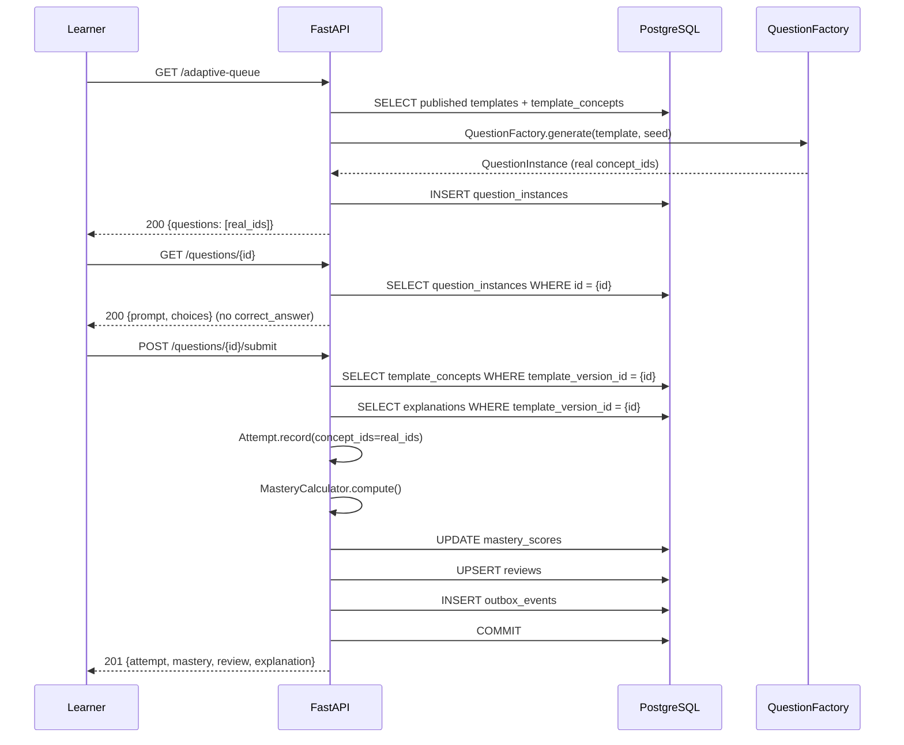

# Vertical Slice 04 — Complete Content Factory Integration

> **Status:** v1.0 — Every placeholder removed. The learning loop runs entirely on real, data-driven content.

---

## What This Is

This slice completes the integration between the Content System (Task 013) and the Learning Loop (Tasks 011–012). Every placeholder UUID is replaced with real content:

- **Queue Generator** loads published templates → generates real QuestionInstances via QuestionFactory → persists to DB
- **Question Retrieval** serves the persisted QuestionInstance (never regenerates)
- **Submit Flow** loads real concept_ids from `template_concepts` → mastery updates reference real concepts
- **Explanations** load from the `explanations` table (not dynamically built)
- **Duplicate Prevention** ensures no template is served twice in one session

## Architecture (Integrated)

```
Learner starts session
    ↓
GET /study-sessions/{id}/adaptive-queue
    ↓
Load published QuestionTemplates + TemplateVersions
    ↓
Load template_concepts (real concept IDs)
    ↓
DeterministicQueueGenerator (selects + ranks)
    ↓
For each selected template:
    QuestionFactory.generate(template, seed)
        ├── VariableGenerator (deterministic)
        ├── TemplateEngine ({{placeholder}} expansion)
        └── Correct answer + Distractor generation
    ↓
Persist QuestionInstance to DB
    ↓
Return real QuestionInstance IDs
    ↓
Learner opens question (GET /questions/{id})
    ↓
Serves persisted QuestionInstance (never regenerates)
    ↓
Learner submits answer (POST /questions/{id}/submit)
    ↓
Load real concept_ids from template_concepts
    ↓
Attempt.record(concept_ids=real_ids)  ← NO PLACEHOLDERS
    ↓
For each concept_id:
    MasteryCalculator.compute(attempt_history)
    MasteryScore.apply_update()
    Review.schedule/reschedule()
    ↓
Load explanation from explanations table
    ↓
Return: attempt + mastery + review + explanation + recommendation
```

## Sequence Diagram



## Queue Flow (Integrated)

| Step | Before (Task 012) | After (Task 014) |
|---|---|---|
| 1. Load templates | Not done | `SELECT published templates + template_versions + template_concepts` |
| 2. Select templates | Random UUIDs | `DeterministicQueueGenerator` ranks by priority |
| 3. Generate questions | `uuid4()` placeholder | `QuestionFactory.generate(template, seed)` |
| 4. Persist questions | Not done | `INSERT INTO question_instances` |
| 5. Return IDs | Placeholder UUIDs | Real persisted QuestionInstance IDs |
| 6. Duplicate prevention | Not done | Skip already-served `template_version_id`s |

## Persistence Flow

Every generated QuestionInstance is stored in `assessment.question_instances`:

| Field | Source |
|---|---|
| `id` | QuestionInstance.serve() factory |
| `template_version_id` | From TemplateVersionData |
| `content_version_id` | From active ContentVersion |
| `learner_enrollment_id` | From study session |
| `study_session_id` | From study session |
| `parameter_seed` | Deterministic (session_id + template_id + position) |
| `parameter_values` | VariableGenerator output |
| `rendered_prompt` | TemplateEngine output |
| `rendered_choices` | Distractor generator output |
| `correct_answer` | Correct answer generator output |
| `distractors_with_tags` | Distractor + misconception tags |
| `served_at` | `datetime.now(UTC)` |
| `status` | `"served"` |

## Replay Flow

```
GET /admin/questions/{id}/replay

1. Load QuestionInstance from DB
2. Load TemplateVersion from DB
3. QuestionFactory.replay(template_version, seed)
4. Compare render_hash:
   - Stored hash == Generated hash → "VERIFIED"
   - Stored hash != Generated hash → "MISMATCH"
5. Return verification report
```

## Mastery Flow (Integrated)

| Step | Before (Task 012) | After (Task 014) |
|---|---|---|
| Load concept_ids | `ConceptId(uuid4())` placeholder | `SELECT concept_id FROM template_concepts WHERE template_version_id = ?` |
| Mastery update | Single placeholder concept | Real concept(s) from template |
| Multiple concepts | Not supported | One attempt updates all linked concepts |
| Explanation | Dynamically built string | Loaded from `explanations` table |

## Concept Weighting (Future)

When a template links to multiple concepts with weights:

```
Template → Concept A (weight: 0.8)
         → Concept B (weight: 0.2)

Attempt scored correct:
  Concept A mastery: +0.8 × effective_credit
  Concept B mastery: +0.2 × effective_credit
```

Currently all linked concepts receive equal weight (1.0). Weighted updates are a future extension.

## Caching Strategy

| Cache Key | TTL | Invalidation |
|---|---|---|
| `templates:published:{subject_id}` | 1h | On template publish |
| `content_version:active:{subject_id}` | 1h | On content version publish |
| `explanations:{template_version_id}` | 24h | On template version change |
| `concept_graph:{subject_id}` | 24h | On concept publish |

(Future implementation — Redis caching with event-driven invalidation.)

## Failure Cases

| Scenario | HTTP | Error Code | Recovery |
|---|---|---|---|
| No published templates | 404 | NO_PUBLISHED_CONTENT | Admin publishes templates |
| No active algorithm | 500 | ALGORITHM_VERSION_NOT_ACTIVE | Admin activates algorithm |
| Question not found | 404 | QUESTION_NOT_FOUND | Generate new queue |
| Already answered | 409 | QUESTION_ALREADY_ANSWERED | Get next question |
| Template version missing | 500 | internal error | Re-publish template |

## Performance Notes

- Queue generation: O(N) where N = number of published templates (typically 50–200).
- QuestionFactory.generate(): < 1ms per question (pure computation, no I/O).
- DB writes: batch INSERT for all QuestionInstances in one transaction.
- Total queue generation: target < 500ms for 15 questions.
- Submit flow: target < 200ms (same as Task 012, plus one extra query for template_concepts).

## What Changed from Task 012

| Component | Task 012 | Task 014 |
|---|---|---|
| Queue question_instance_id | `uuid4()` | Real persisted ID |
| Queue concept_id | `uuid4()` | Real concept from template_concepts |
| Submit concept_ids | `ConceptId(uuid4())` | Real from `SELECT template_concepts` |
| Explanation | `_build_explanation()` dynamic | `SELECT FROM explanations` |
| QuestionInstance persistence | Not done | `INSERT INTO question_instances` |
| Duplicate prevention | Not done | Track served template_version_ids |
| Replay verification | Not possible | `QuestionFactory.replay()` + render_hash |
